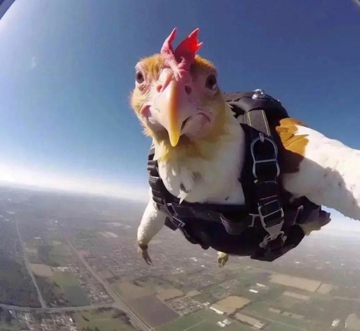

<div align="center">

# 💰 Controle Financeiro Pessoal (CLI)

[](https://python.org)
[](https://pandas.pydata.org)
[]()
</div>

---

## 📋 Sobre o Projeto

Este projeto é um controle financeiro pessoal desenvolvido em Python, que permite registrar ganhos e despesas de forma simples, armazenando os dados em um arquivo CSV e gerando relatórios por período.

> 💡 **Nota:** Este projeto foi desenvolvido acompanhando o excelente tutorial do nosso GOAT **[Tech With Tim](https://www.youtube.com/@TechWithTim)** — um dos melhores canais para aprender programação. Recomendo demais!

🎥 **Vídeo de referência:** [Master Python With This ONE Project!](https://youtu.be/Dn1EjhcQk64)

---

## ✨ Funcionalidades

- ✅ Adicionar transações (ganhos e despesas)
- ✅ Definir data manual ou automática (data atual)
- ✅ Categorização das transações
- ✅ Descrição personalizada para cada lançamento
- ✅ Consulta de lançamentos por período
- ✅ Resumo financeiro com total de ganhos, despesas e saldo
- ✅ Armazenamento persistente em CSV

---


### Menu de Opções

```
1. Adicionar nova transação
2. Ver transações e resumo dentro de um período
3. Sair
```

---

## 📊 Exemplo de Saída

```
Lançamentos de 01-01-2025 até 31-01-2025
        data   valor  categoria          descricao
  01-01-2025 2500.00    Ganhos         Salário mensal
  05-01-2025  350.00  Despesas           Supermercado
  10-01-2025   89.90  Despesas             Internet

Resumo Financeiro
Total de ganhos: R$2500.00
Total de despesas: R$439.90
Saldo: R$2060.10
```

---

## 🛠️ Tecnologias

| Tecnologia | Uso |
|------------|-----|
| Python | Linguagem principal |
| Pandas | Manipulação e filtragem dos dados |
| CSV | Armazenamento dos lançamentos |
| Datetime | Formatação e comparação de datas |

---

## 📝 Aprendizados

Desenvolvendo esse projeto, aprendi sobre:

- Manipulação de arquivos CSV com Python e Pandas
- Trabalho com datas e formatação
- Orientação a objetos com `@classmethod`
- Filtragem de dados por período

---

## 🙏 Créditos

- **Tutorial:** [Master Python With This ONE Project!](https://youtu.be/Dn1EjhcQk64)

---

<div align="center">




</div>
